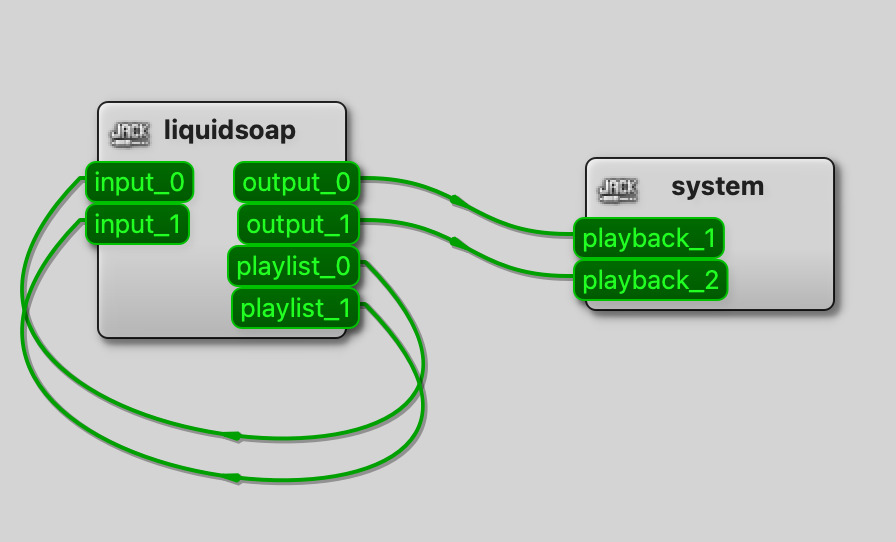

# JACK audio

## What is JACK?

[JACK](https://jackaudio.org/) (JACK Audio Connection Kit) is a professional-grade audio server for
Linux and macOS designed for low-latency inter-application audio routing.
Applications expose named ports and any port can be connected to any other
in a patch-bay style — much like physical cables on a studio mixing desk.

JACK is useful for:

- Live performance: route Liquidsoap outputs to a monitoring system or effects rack.
- Studio setups: send audio to/from a DAW running on the same machine.
- Testing: inspect or record Liquidsoap's audio output without any hardware.

Liquidsoap exposes four JACK-related operators:

- `input.jack` — receive audio from JACK
- `output.jack` — send audio to JACK
- `jack.server.buffer_size()` — query the current JACK buffer size (in samples)
- `jack.server.sample_rate()` — query the current JACK sample rate (in Hz)

## Latency

JACK processes audio in fixed-size blocks. The block size in samples is
`jack.server.buffer_size()` and the duration of each block is:

```
buffer_size / sample_rate   (seconds)
```

For example, a 256-sample buffer at 44100 Hz gives roughly 5.8 ms of
hardware latency.

Because JACK drives Liquidsoap's clock directly (via its process callback),
Liquidsoap wakes up exactly when JACK needs data — not on a CPU timer. It
blocks until the next JACK callback fires, produces one Liquidsoap frame of
audio, and goes back to sleep. No busy-waiting, no drift.

Liquidsoap's own frame duration (default ~100 ms, set via
`settings.frame.duration`) determines how much audio it produces per tick.
With the default, Liquidsoap produces several JACK buffer-lengths of audio at
once; they are queued in an internal ringbuffer and consumed by JACK one block
at a time. This works well for most setups.

## Overruns and underruns

Each channel has a lock-free ringbuffer sitting between Liquidsoap's streaming
thread and JACK's real-time process thread:

- **Output underrun**: JACK's callback fires but the ringbuffer has fewer
  samples than needed. The missing samples are replaced with silence and a
  warning is logged. Typical cause: Liquidsoap's frame size is too large
  relative to the JACK buffer size, or a GC pause delayed the streaming thread.

- **Input overrun**: JACK's callback writes new samples but Liquidsoap hasn't
  consumed the previous ones yet. The excess samples are dropped and a warning
  is logged. Typical cause: Liquidsoap's streaming thread is running too slowly.

In both cases the remedies are:

1. Increase the JACK buffer size in the JACK server settings.
2. Ensure the machine has enough CPU headroom.
3. See the advanced section below for frame-matching.

## OCaml and real-time audio

OCaml's garbage collector can pause execution at any time. JACK's process
callback requires strict, deterministic timing. In practice the two coexist
well because:

- Audio data is exchanged through lock-free ringbuffers, isolating the GC
  from the JACK thread.
- The ringbuffer is pre-filled with silence at startup to absorb transient GC
  pauses.
- Underruns are logged but do not crash the stream.

For demanding setups: run `jackd -R` (real-time scheduling priority) and use
a low-latency kernel.

## Clocks and self-sync

JACK drives its own hardware clock (the process callback fires at precise
intervals set by the audio interface). `input.jack` and `output.jack` are
therefore **self-synchronized** sources — they run on the JACK clock, not
Liquidsoap's internal CPU clock.

When connecting a JACK source to an output that has its own hardware clock
(e.g. `output.ao`, which talks directly to ALSA or Core Audio), the two clocks
must be reconciled. There are two approaches:

**Option 1 — disable self_sync on one side:**

```liquidsoap
output.ao(self_sync=false, input.jack(id="input"))
```

This tells `output.ao` to rely on JACK's clock rather than its own. Simple,
but only works when one side clearly dominates.

**Option 2 — use `buffer()` to cross clock domains:**

```{.liquidsoap include="jack-buffer.liq"}

```

`buffer()` decouples the two clocks by queuing audio between them. It adds a
small, configurable amount of latency but is the safe general-purpose approach.

## Examples

### Passthrough + playlist

Route a JACK input straight back out to JACK, while also playing a playlist
on a separate JACK port. The patchbay below shows how the ports look in a
JACK client manager (e.g. QjackCtl):



```{.liquidsoap include="jack-passthrough.liq"}

```

### Record from JACK to a file

Capture whatever is arriving on the JACK input port to a WAV file:

```{.liquidsoap include="jack-record.liq"}

```

### Connect to a named JACK server

If you run multiple JACK daemons, select the target with the `server`
parameter:

```{.liquidsoap include="jack-server.liq"}

```

### Buffer for clock crossing

Use `buffer()` to safely move audio between the JACK clock domain and another:

```{.liquidsoap include="jack-buffer.liq"}

```

## Advanced: matching frame size to JACK's buffer

> **Note**: This section is for setups specifically tuned for minimum latency.
> It is _not_ recommended for general use.

On a well-configured system (real-time kernel, `jackd -R`, ample CPU
headroom), you can set Liquidsoap's frame duration equal to JACK's buffer
size. This makes Liquidsoap produce exactly one JACK buffer per tick, reducing
end-to-end latency to a single buffer length (e.g. ~5 ms at 44100 Hz with a
256-sample buffer).

On an underpowered or misconfigured machine this will cause frequent
underruns. Start with the default frame size and only tune this if you have a
specific latency target and a stable system.

```{.liquidsoap include="jack-low-latency.liq"}

```

`video.frame.rate := 0` disables the video frame rate constraint so that the
frame duration is determined solely by the audio calculation above.
