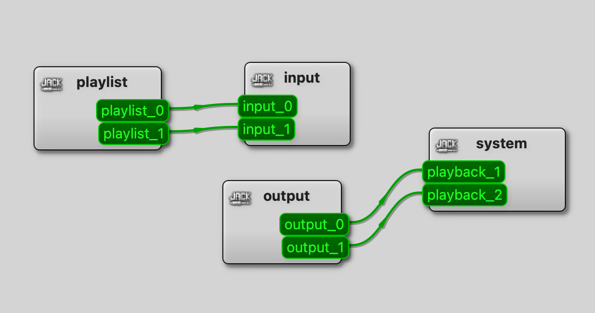

# JACK audio

## What is JACK?

[JACK](https://jackaudio.org/) (JACK Audio Connection Kit) is a low-latency
audio server for Linux and macOS. Applications running on the same machine
register named ports with the server, and any output port can be connected to
any input port, like patch cables on a studio mixing desk.

You can use JACK to:

- route Liquidsoap's output to a monitoring system or an effects rack during a
  live performance,
- send audio to and from a DAW running on the same machine,
- record or inspect Liquidsoap's output without any audio hardware.

Liquidsoap provides the following JACK operators:

- `input.jack` receives audio from JACK.
- `output.jack` sends audio to JACK.
- `jack.server.buffer_size()` returns the current JACK buffer size, in samples.
- `jack.server.sample_rate()` returns the current JACK sample rate, in Hz.

Each `input.jack` and `output.jack` opens its own JACK client, named after the
source's `id`. Set `id` explicitly to get a stable client name. The ports of a
client are named `{id}_0`, `{id}_1`, etc., one per audio channel.

## Latency

JACK processes audio in fixed-size blocks. The block size in samples is
`jack.server.buffer_size()` and the duration of each block is:

```
buffer_size / sample_rate   (seconds)
```

For example, a 256-sample buffer at 44100 Hz gives roughly 5.8 ms of
hardware latency.

The Liquidsoap clock follows the time reported by the JACK server. When the
streaming thread is ahead, it sleeps until a JACK process callback reports
that the target time has been reached. It then produces a Liquidsoap frame,
writes it into a ringbuffer and goes back to sleep.

Liquidsoap's own frame duration (default ~20 ms, set via
`settings.frame.duration`) determines how much audio it produces per tick.
With the default, Liquidsoap produces several JACK buffer-lengths of audio at
once; they are queued in an internal ringbuffer and consumed by JACK one block
at a time. This works well for most setups.

## Overruns and underruns

Each channel has a lock-free ringbuffer between Liquidsoap's streaming thread
and JACK's real-time process thread. The ringbuffer holds up to
`settings.jack.max_latency` seconds of audio (0.5 by default).

- _Output underrun_: JACK's callback fires but the ringbuffer has fewer
  samples than needed. The missing samples are replaced with silence and an
  `output underrun` message is logged. This happens when the streaming thread
  is late, for instance because of CPU load or a garbage collector pause.
- _Input overrun_: JACK's callback writes new samples but the ringbuffer is
  full because Liquidsoap has not consumed the previous ones yet. The excess
  samples are dropped and an `input overrun` message is logged. This happens
  when the streaming thread runs too slowly.

In both cases the remedies are:

1. Increase the JACK buffer size in the JACK server settings.
2. Make sure the machine has enough CPU headroom.
3. Align Liquidsoap's frame size with the JACK buffer, as described in the
   advanced section below.

## OCaml and real-time audio

OCaml's garbage collector can pause the streaming thread at any time, while
JACK's process callback runs on a strict schedule. Liquidsoap handles this
as follows:

- Audio data goes through lock-free ringbuffers, so a garbage collector pause
  in the streaming thread leaves the JACK thread running.
- `output.jack` pre-fills its ringbuffer with one frame of silence (plus one
  JACK buffer when the sizes are not aligned) when it starts, to absorb short
  pauses.
- Underruns and overruns are logged and the stream keeps going.

For demanding setups, run `jackd -R` (real-time scheduling priority) and use a
low-latency kernel.

## Clocks and self-sync

The JACK server paces its process callback with the audio interface's
hardware clock. `input.jack` and `output.jack` are therefore
_synchronization sources_ for their clock (see [clocks](./clocks.md)). All the
JACK operators connected to the same JACK server share one synchronization
source, so an `input.jack` feeding an `output.jack` works out of the box.

When you connect a JACK source to an output that has its own hardware clock,
for instance `output.ao`, the clock ends up with two synchronization sources
and Liquidsoap reports a conflict. There are two ways to resolve it.

The first one is to set `self_sync=false` on the other output, so that it
follows JACK's timing:

```liquidsoap
output.ao(self_sync=false, input.jack(id="input"))
```

This is simple, but the two devices still run on different hardware clocks
and the drift between them eventually causes glitches.

The second one is to use `buffer()`, which places each side in its own clock:

```{.liquidsoap include="jack-buffer.liq" from="BEGIN" to="END"}

```

`buffer()` queues audio between the two clocks. It adds a small, configurable
amount of latency and is the safe general-purpose approach.

## Examples

### Passthrough + playlist

Route a JACK input straight back out to JACK, while also playing a playlist
on a separate JACK client. The patchbay below shows how the three Liquidsoap
clients (`playlist`, `input`, `output`) appear in a JACK client manager
(e.g. QjackCtl): `playlist` feeds into `input`, and `output` goes to system
playback.



```{.liquidsoap include="jack-passthrough.liq" from="BEGIN" to="END"}

```

### Record from JACK to a file

Capture whatever is arriving on the JACK input port to a WAV file:

```{.liquidsoap include="jack-record.liq" from="BEGIN" to="END"}

```

### Connect to a named JACK server

If you run multiple JACK daemons, select the target with the `server`
parameter:

```{.liquidsoap include="jack-server.liq" from="BEGIN" to="END"}

```

## Programmatic port connections

`input.jack` and `output.jack` have a `ports()` method that returns the list
of JACK ports registered by the operator. `input.jack` returns
`[jack_input_port]` and `output.jack` returns `[jack_output_port]`. The two
types are distinct, so the type checker only lets you connect an output port
to an input port.

Each port value has two methods:

- `name()` returns the full JACK port name, e.g. `"out:out_0"`.
- `connect(other)` connects this port to a port of the opposite direction. On
  an output port, `connect` takes a `jack_input_port`. On an input port,
  `connect` takes a `jack_output_port`.

`input.jack` and `output.jack` also have a `connect` method that connects all
their ports to another operator at once:

```{.liquidsoap include="jack-connect.liq"}

```

You can call `connect` when the script is defined: Liquidsoap makes the actual
`jack_connect` call once both operators have woken up and registered their
JACK ports.

### Connecting to server capture and playback ports

`jack.server.capture()` and `jack.server.playback()` give access to the
physical hardware ports of the JACK server, `system:capture_*` and
`system:playback_*` respectively. Each returns a record with a `connect`
method that works like the one on `input.jack` and `output.jack`, so you can
wire everything from your script:

```{.liquidsoap include="jack-server-ports.liq"}

```

A few details:

- In JACK's own naming, `system:capture_*` ports are output ports: they send
  audio from the hardware into the graph. `system:playback_*` ports are input
  ports: they send audio from the graph to the hardware.
  `jack.server.capture()` connects to an `input.jack` and
  `jack.server.playback()` connects to an `output.jack`, following this
  convention.
- `jack.server.playback().connect(o)` can also be called when the script is
  defined. The actual `jack_connect` call happens once the operator has woken
  up and registered its JACK ports.
- Both functions accept a `server` parameter for multi-daemon setups, like
  `input.jack` and `output.jack`.

`connect` matches port counts as follows:

- If one side has a single port, it is connected to every port on the other
  side.
- If both sides have the same number of ports, they are connected pairwise
  (channel 0 to channel 0, channel 1 to channel 1, etc.).
- Any other combination raises `error.invalid` at connection time.

## Advanced: minimizing latency

This section is for setups tuned for minimum latency. Keep the default
settings for general use.

End-to-end latency between Liquidsoap and JACK depends on how well the two
frame sizes and sample rates align. There are three levels of tuning, in
increasing order of aggressiveness.

### Step 1: match sample rates

Set Liquidsoap's audio sample rate to JACK's. When the rates differ,
Liquidsoap resamples every buffer, which costs CPU and adds latency:

```liquidsoap
settings.frame.audio.samplerate := jack.server.sample_rate()
```

### Step 2: make Liquidsoap's frame a multiple of the JACK buffer

Liquidsoap produces audio in fixed-size frames (default ~20 ms). Set the
frame duration so that its sample count is an exact multiple of the JACK
buffer size. Reads and writes then stay aligned to JACK buffer boundaries, and
`output.jack` skips the extra JACK buffer of silence padding:

```liquidsoap
# Example: 4 times the JACK buffer
settings.frame.duration :=
  4. * float_of_int(jack.server.buffer_size()) /
    float_of_int(jack.server.sample_rate())
```

### Step 3: match exactly one JACK buffer

On a well-configured system (real-time kernel, `jackd -R`, ample CPU
headroom) you can set Liquidsoap's frame duration to exactly one JACK buffer.
Liquidsoap then produces audio one JACK buffer at a time, which reduces
end-to-end latency to a single buffer length (e.g. ~5.8 ms at 44100 Hz with a
256-sample buffer):

```{.liquidsoap include="jack-low-latency.liq" from="BEGIN" to="END"}

```

`video.frame.rate := 0` disables the video frame rate constraint so that the
frame duration is determined solely by the audio calculation above.

On an underpowered or misconfigured machine this setting causes frequent
underruns. Use it only when you have a specific latency target and a stable,
well-tuned system.
